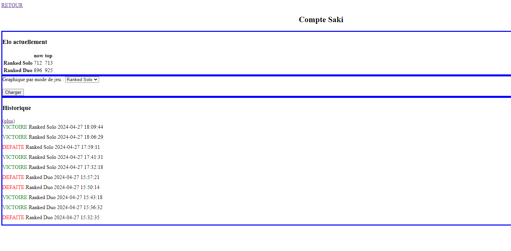
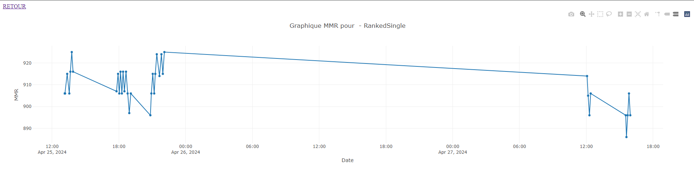

# Stats Maxime Plugin

Ce plugin est toujours en développement. 
Il permet d'envoyer a un serveur externe par défaut [histo.tellebma.fr](https://historl.tellebma.fr/) les données de fin de partie Victoire/défaite, MMR gagngé, etc

L'interface front est également toujours en développement [Github front](https://github.com/tellebma/FrontStatsPlugin)





# Release 
Vous pouvez trouver le fichier .dll du plugin a tout moment de son développement dans plugin/StatsMaximePlugin.dll

Il est possible de changer le serveur target pour cela modifier la variable API_ENDPOINT dans le fichier StatsMaximePLugin.cpp
```cpp
#define API_ENDPOINT "http://localhost:5000"
```


